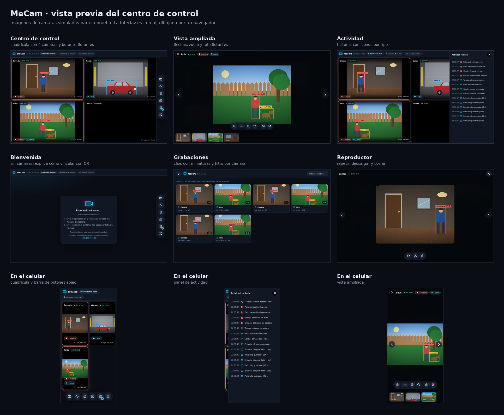

# MeCam

Convierte celulares Android viejos en cámaras de seguridad con detección de personas y autos.

**¿Dudas?** Mira las [preguntas frecuentes](FAQ.md): cómo ver las cámaras desde fuera de casa, cómo evitar el calor, qué hacer si algo falla y más.

## Vista previa

*Imágenes de cámaras simuladas; la interfaz es la real.* Las capturas sueltas están en [`docs/vista-previa`](docs/vista-previa).

## Cómo funciona

1. **App MeCam (Android):** corre en segundo plano (con la pantalla apagada) y transmite video de forma constante a la computadora. Si el celular se calienta, baja la velocidad y, si sigue subiendo, se pausa hasta que se enfríe. Detecta si el celular está vertical u horizontal y adapta la imagen.
2. **Servidor (computadora):** recibe el video, detecta y sigue personas y autos con YOLO, y los muestra en un centro de control web con todas las cámaras. Cuando detecta una persona, guarda un clip corto que se puede ver, descargar o borrar desde la página de grabaciones.
3. **Vinculación por QR:** para conectar un celular (o un aparato que solo quiera ver las cámaras) se escanea un QR que muestra el centro de control. Cada QR es distinto y sirve una sola vez, cada dispositivo recibe su propia credencial y las cámaras se conectan cifradas.

El video no sale de tu red: no se sube a ningún servidor de terceros.

## Instalar la app

1. En el celular, abre la sección **Releases** de este repositorio y descarga `MeCam.apk`.
2. Ábrelo y permite instalar apps de origen desconocido si el celular lo pide.
3. En la app toca **Escanear QR para vincular** y apunta al QR que aparece en el centro de control de la computadora (o en la ventana de MeCam, botón **Vincular dispositivo**). La cámara se enciende sola al vincular, y el semáforo de la app muestra su estado (rojo: detenida, amarillo: conectando, verde: transmitiendo).

La app avisa cuando hay una versión nueva y se actualiza desde dentro (Android siempre pide confirmar la instalación).

## Ejecutar el servidor (Windows)

1. Instala **Python** desde `python.org/downloads` y marca la casilla **Add python.exe to PATH**.
2. Descarga el proyecto (en esta página, **Code** y luego **Download ZIP**) y extráelo. Abre la carpeta `servidor`.
3. Haz doble clic en **Iniciar MeCam.bat**. La primera vez instala lo necesario y tarda varios minutos.
4. En la ventana de MeCam, haz clic en el botón verde **Iniciar servidor**.
5. El QR aparece solo en la pantalla de bienvenida del centro de control (uno distinto, de un solo uso, por cada celular). Más tarde, el botón **Vincular dispositivo** muestra uno nuevo.

La ventana abre el centro de control (`https://localhost:8443/ver`) y muestra la lista de dispositivos vinculados. La computadora y los celulares deben estar en la misma red Wi-Fi. Si algo no conecta, usa el botón **Abrir puertos del firewall** (una sola vez) o revisa las [preguntas frecuentes](FAQ.md).

Si prefieres la terminal: `cd servidor`, `python -m pip install -r requirements.txt` y `python servidor.py`.

Las grabaciones se guardan en `%APPDATA%\MeCam\grabaciones` (botón **Abrir carpeta** de la ventana), sin subirse a ninguna nube.

Para actualizar el servidor, descarga el proyecto de nuevo y abre **Iniciar MeCam.bat** de la carpeta nueva: los dispositivos vinculados se guardan en `%APPDATA%\MeCam` y se conservan.

## Estado del proyecto

- [x] Video constante desde el celular
- [x] Detección y seguimiento (YOLO + ByteTrack)
- [x] Varias cámaras a la vez
- [x] Servicio en segundo plano y control de temperatura
- [x] Orientación automática (vertical/horizontal)
- [x] Actualización desde dentro de la app
- [x] Ventana con botón verde para iniciar y detener el servidor
- [x] Centro de control en el navegador (cuadrícula automática, ampliar, zoom, fotos, alertas y actividad)
- [x] Nombres únicos por cámara y limpieza automática de cámaras desconectadas
- [ ] Audio
- [x] Grabación de clips cuando se detecta una persona (optativa: se activa o desactiva y se elige por cámara; se borran solos los viejos)
- [x] Centro de control con botones flotantes, íconos nuevos y atajos de teclado
- [ ] Zonas de alerta
- [x] Vinculación por QR: un código distinto y de un solo uso por dispositivo, con conexión cifrada
- [x] La app enciende la cámara al vincular, muestra un semáforo de estado y evita duplicar el dispositivo
- [ ] Detección dentro del propio celular (sin computadora)

## Seguridad y privacidad

- Cuando vinculas el primer dispositivo, MeCam se **protege**: solo entran los dispositivos vinculados con un QR (además de esta computadora y de tu red Tailscale). Mientras no hayas vinculado nada, la ventana muestra «Abierto». **No abras puertos en tu router.** Para verlas desde fuera de casa usa una VPN, como se explica en las [preguntas frecuentes](FAQ.md).
- **Compartir la app no comparte tu acceso:** el APK es igual para todos y no lleva ninguna credencial. Cada celular se vincula con un QR de su propia computadora, que sirve una sola vez y vence en 5 minutos. Cuida el QR mientras está a la vista.
- Grabar personas o la vía pública puede estar regulado (por ejemplo, RGPD en Europa). Úsalo solo en espacios propios y avisa a quien pueda ser grabado.

## Créditos

Los íconos son de [Phosphor Icons](https://phosphoricons.com) (licencia MIT). Mira [LICENCIAS.md](LICENCIAS.md).
